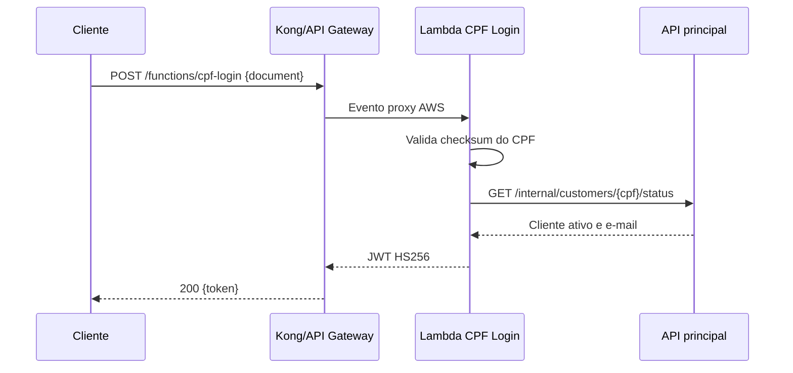

# Lambda de login por CPF

Função serverless do Tech Challenge - Fase 3 responsável por autenticar clientes pelo CPF. Ela valida o documento, consulta a API principal para confirmar que há um cliente ativo e devolve um JWT aceito pelas rotas protegidas da aplicação.

## Como funciona



O handler é `org.project.mechanic_shop.cpflogin.CpfLoginRequestHandler::handleRequest`. Ele aceita um evento de integração proxy do API Gateway ou do plugin `aws-lambda` do Kong, somente pelo método `POST`, com corpo JSON `{"document":"<cpf>"}`.

| Código | Significado |
|---|---|
| `200` | CPF válido, cliente existe e está ativo; retorna `token` |
| `400` | Corpo ausente/malformado ou CPF inválido |
| `404` | Não existe cliente ativo com o CPF informado |
| `405` | Método diferente de `POST` |
| `502` | Não foi possível consultar a API principal |

## Tecnologias

Java 21, AWS Lambda Java Core/Events, Java JWT (Auth0), Maven, JUnit 5 e Mockito.

## Pré-requisitos e configuração

Para build local, use JDK 21 e Maven 3.9+.

No ambiente AWS, configure estas variáveis na Lambda:

- `JWT_SECRET`: mesmo segredo da API e do Kong;
- `JWT_ISSUER`: emissor do token; o padrão é `mechanic-shop-api`;
- `INTERNAL_API_BASE_URL`: URL interna alcançável da API principal;
- `INTERNAL_API_SECRET`: mesmo valor de `internal.api.secret` da API.

Nunca versionar os valores reais dessas variáveis.

## Executar, testar e empacotar

```bash
git clone <URL_DO_REPOSITORIO>
cd mechanic-shop-pos-tech-challenger-lambda
mvn test
mvn package
```

O pacote de deploy é `target/cpf-login-lambda.jar`. Para uma execução de desenvolvimento, há o `LocalRunner` em testes; ele não substitui a integração real com AWS/Kong.

## Implantação e API

A infraestrutura da função - IAM, rede, permissões de invocação e integração com Kong - é criada pelo repositório `mechanic-shop-pos-tech-challenger-kubernetes`, no diretório `lambda/`. Depois de criada, publique o JAR com `aws lambda update-function-code` ou por uma pipeline autenticada via OIDC.

Esta função não expõe Swagger próprio: seu contrato é o evento Lambda descrito acima. A documentação das APIs consumidas pelo usuário está no [Swagger da aplicação principal](http://localhost:8080/swagger-ui.html), quando o ambiente local estiver em execução.

Este checkout não contém workflow de CI/CD versionado. Para aderir ao enunciado, a pipeline deve testar e empacotar em pull requests e atualizar o código da Lambda somente nas branches autorizadas.
